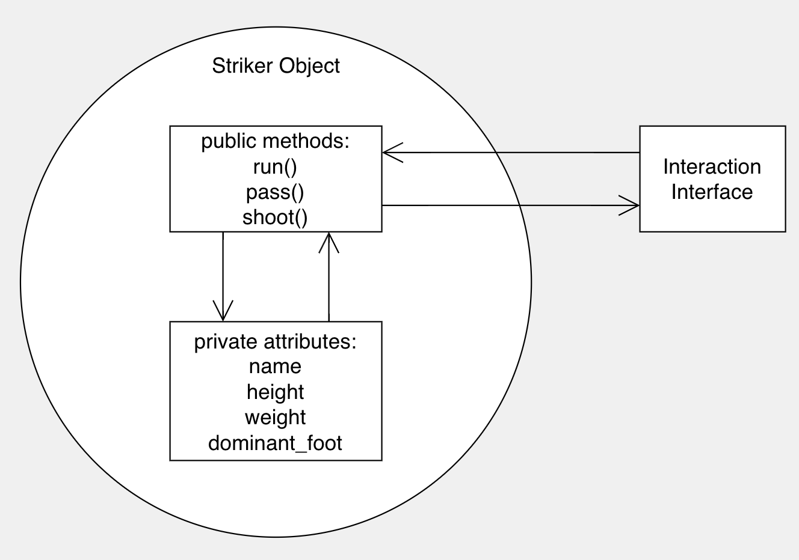

# Machine Learning Soccer

## **Table of Contents**
1. [Preface](#Preface)
2. [Basics of Object Oriented Programming](#OOP)
    1. [Class and Object](#ClassAndObject)
    2. [Inheritance and Polymorphism](#InheritanceAndPolymorphism)
    3. [Encapuslation](#Encapsulation)
3. [Unity and ML-Agent](#UnityAndMLAgents)
    1. [Scripts](#Scripts)
    2. [Rigidbody](#Rigidbody)
    3. [Collider](#Collider)
    4. [Agent](#Agent)
    5. [Policy](#Policy)
4. [Create a Deep Reinforcement Learning Environment in Unity](#CreateEnv)
    1. [Environment Setup](#EnvSetup)
    2. [Project Structure](#Structure)
    3. [Create GameObjects](#CreateGameObjects)
    4. [Initializing the Environment](#Initialization)
    5. [Observing the Environment](Observation)
    6. [Taking Actions](#Actions)
    7. [Assigning Reward](#Reward)
    8. [Agent Setup](#AgentSetup)
    9. [Testing](#Test)
    10. [Training](#Train)
5. [What's Next](#WhatsNext)
6. [Reference](#Reference)


## **Preface**

As a soccer enthusiast, I am constantly astonished by the imaginative attacks and dedicated defenses during a high-level match. I wish to replicate such plays in the games; controlling a team and letting it achieve your tactical intentions is tempting. However, due to the physical constrain, we can only handle one player at a time; the off-ball players’ behaviors in the game then become quintessential: the immersive gaming experience vanishes quickly when we notice all kinds of ridiculous, erratic movements and decisions made by the computer-controlled players in the nowadays mainstream soccer games. 

In the past few years, breakthroughs flourished in reinforcement learning. We have witnessed the success of Reinforcement-Learning-based computer programs, such as [AlphaGo](https://www.deepmind.com/research/highlighted-research/alphago) and [OpenAI Five](https://openai.com/five/). By playing against different versions of themselves repeatedly, each time learning from their mistakes, they have become increasingly more robust and better at learning and decision-making, and therefore, being able to defeat professional human players. Naturally, an idea came to my mind: can we apply deep reinforcement learning to the computer-controlled players in soccer games so that they can behave in a less mechanized but more human-like way?

The answer is yes. The Google Brain team has already developed an open-source reinforcement learning environment [Google Research Football](https://github.com/google-research/football). Reinforcement learning works best for scenarios where it is easy to define success but hard to find how to get there. In a soccer game, we can quickly determine success or not by looking at the scoreboard. And it is undoubtedly hard to find a way to score a goal. Unlike conventional soccer games, in which programmers define specific preset strategies for the computer-controlled players to play the game, reinforcement learning provides a soccer environment. It lets them learn the patterns by exploring the environment. 

The idea above sounds simple, but how to implement it is going to be challenging. Consequently, it is wise to break the seemingly impossible mission down into some more achievable smaller steps. Meanwhile, the Feynman Technique of learning suggests that when we want to develop a deep understanding of a topic, we can try to explain it in a straightforward, simple way to others. Therefore, creating this repository allows me to deepen my understanding of relative knowledge in Game Development (Unity) and Machine Learning (Deep Reinforcement Learning). I would also be glad if this repository helps others interested in both areas but struggled at these beginning steps.  

## **Object Oriented Programming<a name="OOP"></a>**
### **Class and Object<a name="ClassAndObject"></a>**
Before diving in, it is essential to highlight some basic concepts of Object Oriented Programming. It is a fundamental and indispensable programming paradigm for game designs using Unity and ML-Agent toolkits. 

When we think about creating a game from scratch, we might wonder about the program’s overall structure. If we define all the variables and functions line by line, we will get lost as the size of the program increases. Instinctively, the idea of `Object` and `Class` comes to mind: we can create classes with abstract definitions representing the types of objects we want to have in our game. 

For example, if we were modeling a soccer game, we could use objects representing players. Every player shares some properties in common: they all have a name, height, weight, and dominant foot. Additionally, every player can perform certain things: run, dribble, tackle, pass, and shoot the ball. So, Player could be a class in our game system. The definition of the class lists the `Attributes` and `Methods` that every player has.

In pseudocode, a Player class could be written like this:

```
class Player
	attributes
		name
		height
		weight
		dominant_foot
	methods
		run()
		dribble()
		tackle()
		pass()
		shoot()
```

The class is just a blueprint and doesn’t do anything independently, but we can create objects using the blueprint provided by the class. These objects we make can interact with each other in the game environment. Programming languages often use the keyword `new` to singal that an object is being initialized. We can then use `.` operator to call the methods of that object. 

```C#
playerA = new Player(“playerA”, 185, 85, “right”);

playerA.run();
playerA.pass();
```

### **Inheritance and Polymorphism<a name="InheritanceAndPolymorphism"></a>**

Different players play different roles during a soccer match. A goalie primarily makes saves, while a striker primarily focuses on finishing. It would be helpful if we could represent that goalies and strikers share some properties. Inheritance lets us do this. 

We start by observing that goalies and strikers are both players. They both have names, heights, weights, and dominant feet; they must be able to perform runs and passes. Then, Striker class and Goalie class can both be derived from Player class. We can achieve that by modifying the original Player class and adding some additional properties to the inherited classes:

```
class Player
	attributes
		name
		height
		weight
		dominant_foot
	methods
		run()
        pass()

class Striker : extends Player
    attributes
    methods
        run()
		shoot()

class Goalie : extends Player
    attributes
    methods
        run()
        save()
```

In this case, Player class is the `parent` class of both Goalie and Striker classes. Conversely, Goalie and Striker classes are `child` classes of  Player class. 

We intentionally define the method run() in all three classes. The reason is that we want to have different running styles for the goalie and striker. And there is a default running style for general players. This feature - when a method has the same name but a different implementation in different classes - is called `polymorphism`. When a method in a child class replaces the parent class’s implementation, we say that the child class `overrides` the version in the parent class. 

### **Encapsulation<a name="Encapsulation"></a>**
Objects provide an interface to other code that wants to use them but maintain their internal state. The object's internal state is kept private, meaning it can only be accessed by its own methods, not from other objects. Keeping an object's internal state private and generally making a clear division between its public interface and its private internal state is called `encapsulation`.


<figcaption>Encapsulation Diagram for Striker class</figcaption>

$~$

This is a useful feature because it enables the programmer to change the internal implementation of an object without having to find and update all the code that uses it: it creates a kind of firewall between this object and the rest of the system.

In many OOP languages, we can prevent other code from accessing an object's internal state by marking some properties as `private`. It will generate an error if code outside the object tries to access them.

## **Unity and ML-Agents<a name="UnityAndMLAgents"></a>**
There are a lot of online [tutorials](https://learn.unity.com/project/getting-started?uv=2020.3&courseId=5cf96c41edbc2a2ca6e8810f) and [documentations](https://docs.unity3d.com/Manual/index.html) that would help familiarize yourself with Unity. In this section, I only focus on the concepts related to this specific repository. 

### **Scripts<a name="Scripts"></a>**
When we create a C# script

## **Create a Deep Reinforcement Learning Environment in Unity<a name="CreateEnv"></a>**